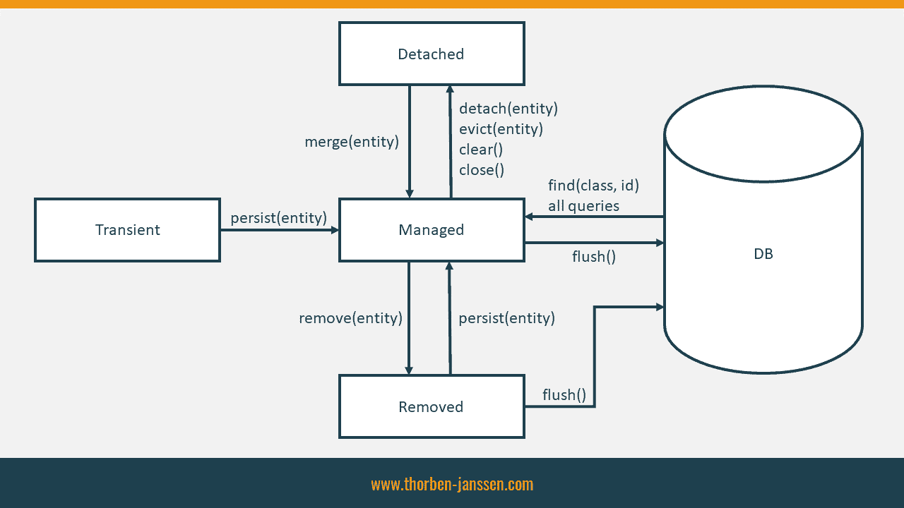

## **HIBERNATE**

[Hibernate](https://hibernate.org) - **Hibernate ORM** (or simply **Hibernate**) is an [object–relational mapping](https://en.wikipedia.org/wiki/Object%E2%80%93relational_mapping "Object–relational mapping") tool for the [Java](https://en.wikipedia.org/wiki/Java_(programming_language)) "Java (programming language)") programming language. It provides a [framework](https://en.wikipedia.org/wiki/Software_framework "Software framework") for mapping an [object-oriented](https://en.wikipedia.org/wiki/Object-oriented_programming "Object-oriented programming") domain model to a [relational database](https://en.wikipedia.org/wiki/Relational_database "Relational database"). Hibernate handles [object–relational impedance mismatch](https://en.wikipedia.org/wiki/Object%E2%80%93relational_impedance_mismatch "Object–relational impedance mismatch") problems by replacing direct, [persistent](https://en.wikipedia.org/wiki/Persistence_(computer_science)) "Persistence (computer science)") database accesses with high-level object handling functions.

# Entity Lifecycle Model in JPA

Se also: [Lifecycle Model](https://thorben-janssen.com/entity-lifecycle-model/)

The semantics of the persist operation, applied to an entity X are as follows:

If X is a new entity, it becomes managed. The entity X will be entered into the database at or before transaction commit or as a result of the flush operation.

If X is a preexisting managed entity, it is ignored by the persist operation. However, the persist operation is cascaded to entities referenced by X, if the relationships from X to these other entities are annotated with the cascade=PERSIST or cascade=ALL annotation element value or specified with the equivalent XML descriptor element.

If X is a removed entity, it becomes managed.

If X is a detached object, the EntityExistsException may be thrown when the persist operation is invoked, or the EntityExistsException or another PersistenceException may be thrown at flush or commit time.

For all entities Y referenced by a relationship from X, if the relationship to Y has been annotated with the cascade element value cascade=PERSIST or cascade=ALL, the persist operation is applied to Y.

The semantics of the merge operation applied to an entity X are as follows:

If X is a detached entity, the state of X is copied onto a pre-existing managed entity instance X' of the same identity or a new managed copy X' of X is created.

If X is a new entity instance, a new managed entity instance X' is created and the state of X is copied into the new managed entity instance X'.

If X is a removed entity instance, an IllegalArgumentException will be thrown by the merge operation (or the transaction commit will fail).

If X is a managed entity, it is ignored by the merge operation, however, the merge operation is cascaded to entities referenced by relationships from X if these relationships have been annotated with the cascade element value cascade=MERGE or cascade=ALL annotation.

For all entities Y referenced by relationships from X having the cascade element value cascade=MERGE or cascade=ALL, Y is merged recursively as Y'. For all such Y referenced by X, X' is set to reference Y'. (Note that if X is managed then X is the same object as X'.)

If X is an entity merged to X', with a reference to another entity Y, where cascade=MERGE or cascade=ALL is not specified, then navigation of the same association from X' yields a reference to a managed object Y' with the same persistent identity as Y.